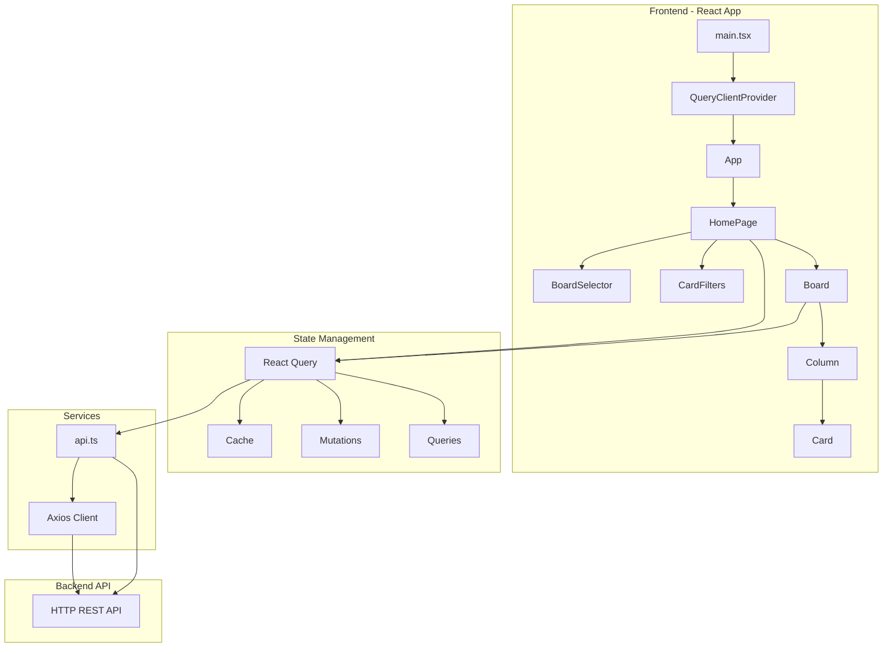
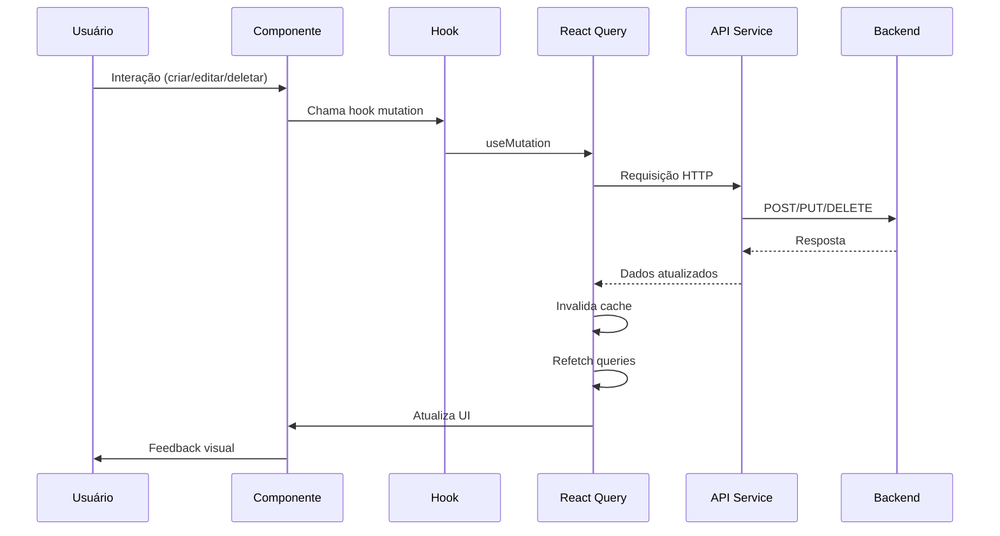
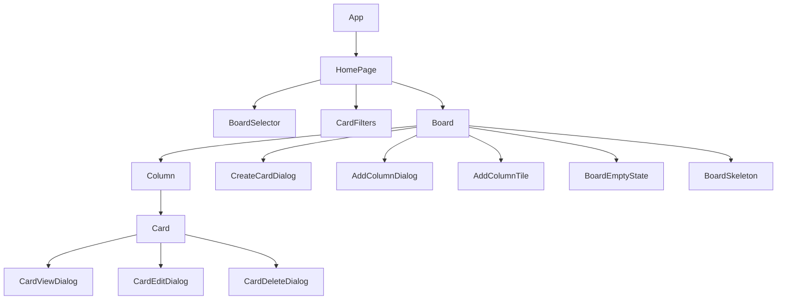
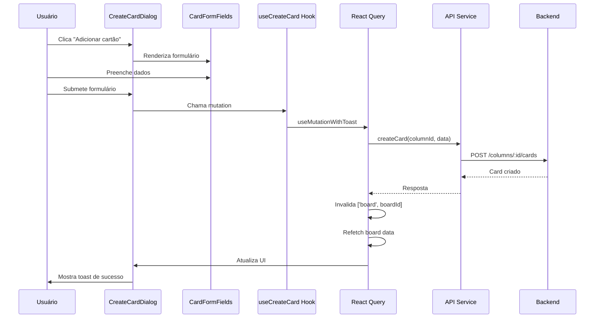
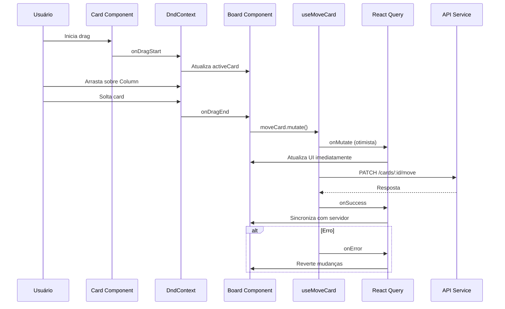
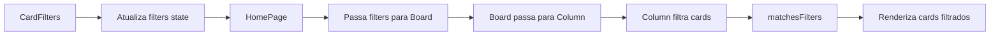
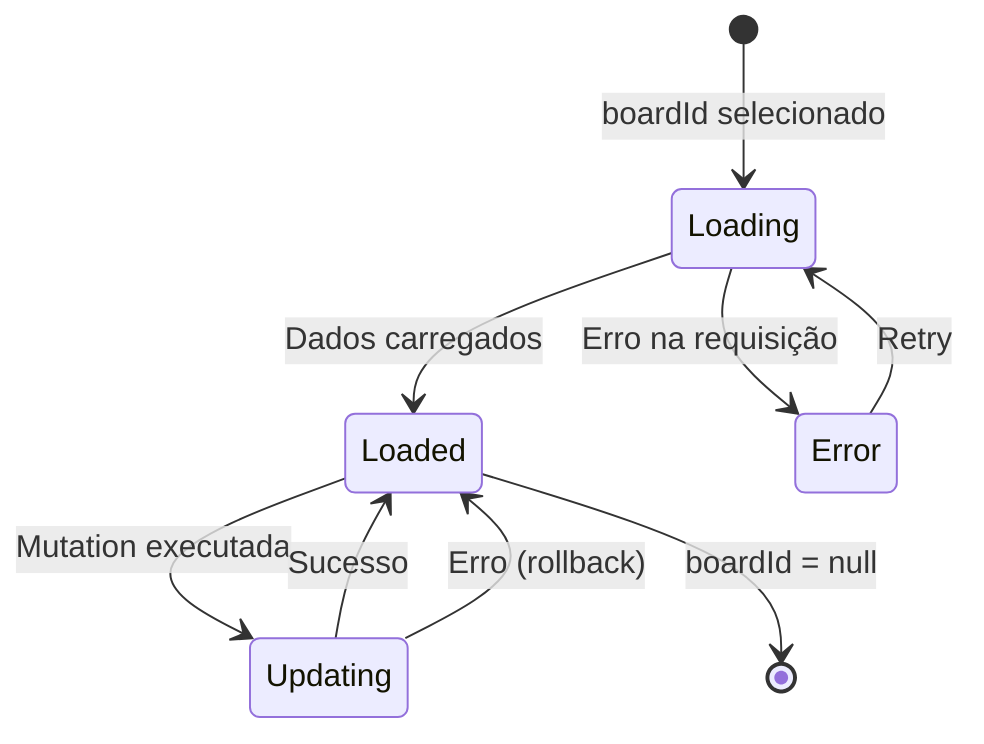
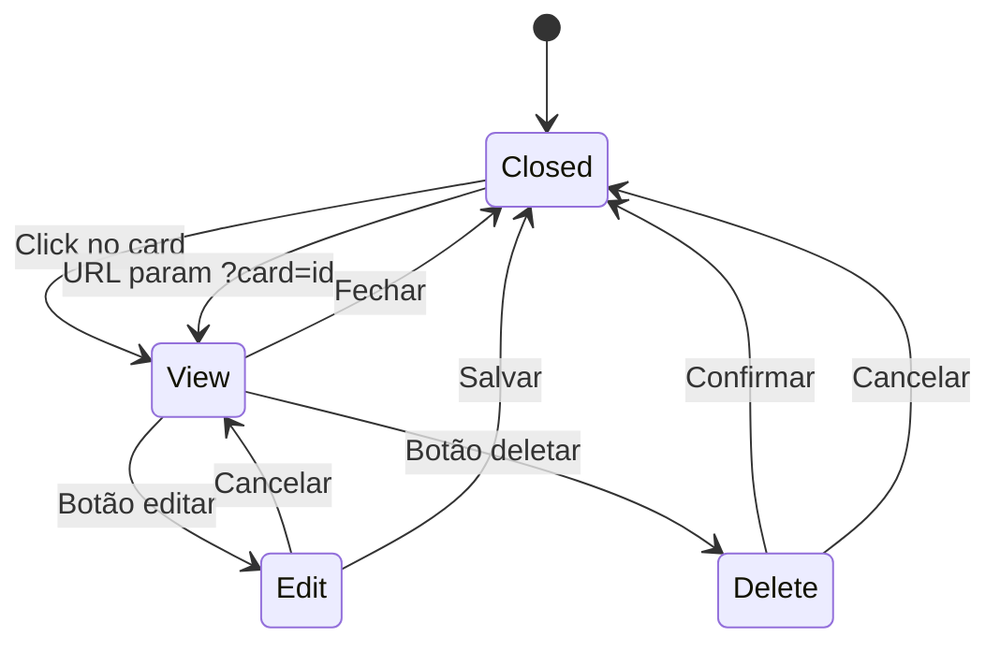

# Documentação da Aplicação Web - Task Manager

## 📋 Índice

- [Visão Geral](#visão-geral)
- [Arquitetura](#arquitetura)
- [Tecnologias](#tecnologias)
- [Estrutura do Projeto](#estrutura-do-projeto)
- [Fluxo de Dados](#fluxo-de-dados)
- [Componentes Principais](#componentes-principais)
- [Funcionalidades](#funcionalidades)
- [Configuração](#configuração)
- [Desenvolvimento](#desenvolvimento)
- [Build e Deploy](#build-e-deploy)

## 🎯 Visão Geral

A aplicação web é uma interface React moderna para gerenciamento de tarefas estilo Kanban. Permite criar e gerenciar quadros (boards), colunas e cartões (cards) com funcionalidades de drag-and-drop, filtros avançados e sincronização de estado via URL.

### Características Principais

- ✅ Interface Kanban interativa com drag-and-drop
- ✅ Gerenciamento de múltiplos quadros
- ✅ Filtros por tipo, prioridade e datas
- ✅ Design responsivo e acessível

## 🏗️ Arquitetura

### Arquitetura Geral



### Fluxo de Dados



## 🛠️ Tecnologias

### Core
- **React 19.2.0** - Biblioteca UI
- **TypeScript 5.9.3** - Tipagem estática
- **Vite 7.2.4** - Build tool e dev server

### Gerenciamento de Estado
- **@tanstack/react-query 5.90.16** - Cache e sincronização de dados
- **React Hooks** - Estado local e lógica reutilizável

### UI e Estilização
- **Tailwind CSS 4.1.18** - Framework CSS utility-first
- **Radix UI** - Componentes acessíveis e não-estilizados
  - `@radix-ui/react-dialog`
  - `@radix-ui/react-dropdown-menu`
  - `@radix-ui/react-select`
  - `@radix-ui/react-popover`
  - `@radix-ui/react-alert-dialog`
  - `@radix-ui/react-scroll-area`
- **Lucide React** - Ícones
- **next-themes** - Gerenciamento de tema

### Drag and Drop
- **@dnd-kit/core** - Biblioteca de drag-and-drop
- **@dnd-kit/sortable** - Extensão para ordenação
- **@dnd-kit/utilities** - Utilitários

### HTTP Client
- **Axios 1.13.2** - Cliente HTTP

### Notificações
- **Sonner 2.0.7** - Toast notifications

## 📁 Estrutura do Projeto

```
apps/web/
├── src/
│   ├── components/          # Componentes React
│   │   ├── board/          # Componentes de quadro
│   │   │   ├── Board.tsx
│   │   │   ├── BoardSelector.tsx
│   │   │   ├── BoardEmptyState.tsx
│   │   │   ├── BoardSkeleton.tsx
│   │   │   ├── AddColumnDialog.tsx
│   │   │   └── AddColumnTile.tsx
│   │   ├── column/         # Componentes de coluna
│   │   │   └── Column.tsx
│   │   ├── card/           # Componentes de cartão
│   │   │   ├── Card.tsx
│   │   │   ├── CardViewDialog.tsx
│   │   │   ├── CardEditDialog.tsx
│   │   │   ├── CardDeleteDialog.tsx
│   │   │   ├── CreateCardDialog.tsx
│   │   │   └── CardFormFields.tsx
│   │   ├── filters/        # Componentes de filtro
│   │   │   └── CardFilters.tsx
│   │   └── ui/             # Componentes UI base (shadcn/ui)
│   ├── hooks/              # Custom hooks
│   │   ├── useBoard.ts
│   │   ├── useCard.ts
│   │   ├── useColumn.ts
│   │   ├── useUrlParams.ts
│   │   └── useMutationWithToast.ts
│   ├── services/           # Serviços de API
│   │   └── api.ts
│   ├── lib/                # Utilitários
│   │   ├── utils.ts
│   │   └── filters.ts
│   ├── types/              # Definições TypeScript
│   │   ├── index.ts
│   │   ├── card.ts
│   │   └── filters.ts
│   ├── pages/              # Páginas
│   │   └── HomePage.tsx
│   ├── App.tsx             # Componente raiz
│   ├── main.tsx            # Entry point
│   └── index.css           # Estilos globais
├── public/                 # Arquivos estáticos
├── documentation/          # Documentação
├── package.json
├── vite.config.ts
├── tsconfig.json
└── Dockerfile
```

### Hierarquia de Componentes



## 🔄 Fluxo de Dados

### Fluxo de Criação de Cartão



### Fluxo de Drag and Drop



### Fluxo de Filtros



## 🧩 Componentes Principais

### HomePage

Componente principal que orquestra toda a aplicação.

**Responsabilidades:**
- Gerenciar estado de filtros
- Sincronizar seleção de board/card com URL
- Renderizar header com seletor de board e filtros
- Renderizar Board principal

**Props:** Nenhuma (usa hooks internos)

### Board

Componente que renderiza o quadro Kanban completo.

**Responsabilidades:**
- Gerenciar contexto de drag-and-drop
- Renderizar colunas
- Gerenciar criação de colunas
- Aplicar filtros aos cards
- Atualizações otimistas de movimento

### Column

Componente que representa uma coluna no quadro.

**Responsabilidades:**
- Renderizar cards da coluna
- Aplicar filtros aos cards
- Gerenciar drop zone para drag-and-drop
- Permitir criação de novos cards

### Card

Componente que representa um cartão individual.

**Responsabilidades:**
- Renderizar informações do card
- Gerenciar drag handle
- Abrir dialogs de visualização/edição/exclusão
- Sincronizar com seleção via URL

## 🎣 Hooks Customizados

### useBoard

Gerencia queries relacionadas a boards.

```typescript
// Buscar board específico
useBoard(boardId: string | null)

// Buscar todos os boards
useBoards()

// Criar novo board
useCreateBoard()
```

### useCard

Gerencia mutations relacionadas a cards.

```typescript
// Criar card
useCreateCard(boardId: string)

// Atualizar card
useUpdateCard(boardId: string)

// Deletar card
useDeleteCard(boardId: string)

// Mover card (com atualização otimista)
useMoveCard(boardId: string)
```

### useColumn

Gerencia mutations relacionadas a colunas.

```typescript
// Criar coluna
useCreateColumn(boardId: string)

// Criar múltiplas colunas padrão
useCreateColumns(boardId: string)
```

### useUrlParams

Gerencia sincronização de estado com URL.

```typescript
const { getParam, updateParams } = useUrlParams()

// Obter parâmetro
const boardId = getParam('board')

// Atualizar parâmetros
updateParams({ board: '123', card: '456' })
```

### useMutationWithToast

Wrapper para mutations com feedback automático via toast.

```typescript
useMutationWithToast({
  mutationFn: (data) => api.create(data),
  messages: {
    loading: 'Criando...',
    success: 'Criado com sucesso',
    error: 'Erro ao criar',
  },
  invalidateKeys: [['boards']],
})
```

## 🔧 Funcionalidades

### 1. Gerenciamento de Quadros

- Criar novos quadros
- Selecionar quadro ativo
- Visualizar lista de quadros
- Sincronização com URL (`?board=id`)

### 2. Gerenciamento de Colunas

- Criar colunas personalizadas
- Criar colunas padrão (A fazer, Em progresso, Concluído)
- Visualizar contador de cards por coluna
- Reordenar via drag-and-drop (futuro)

### 3. Gerenciamento de Cards

- Criar cards com:
  - Título e descrição
  - Tipo (Bug, Funcionalidade, Melhoria)
  - Prioridade (Baixa, Média, Alta, Crítica)
  - Datas de início e entrega
- Editar cards existentes
- Deletar cards
- Mover cards entre colunas (drag-and-drop)
- Visualizar detalhes do card

### 4. Filtros

- Filtrar por tipo de item de trabalho
- Filtrar por prioridade
- Filtrar por data de início (range)
- Filtrar por data de entrega (range)
- Filtros combinados

### 5. Drag and Drop

- Arrastar cards entre colunas
- Feedback visual durante drag
- Atualizações otimistas
- Rollback automático em caso de erro

### 6. Sincronização de Estado

- Deep linking via URL
- Seleção de board persistida (`?board=id`)
- Seleção de card persistida (`?card=id`)
- Navegação do browser (voltar/avançar) funcional

## ⚙️ Configuração

### Variáveis de Ambiente

Crie um arquivo `.env` baseado em `.env.example`:

```bash
# URL base da API backend
VITE_API_URL=http://localhost:3000
```

### Configuração do Vite

O projeto usa Vite com as seguintes configurações:

- **Alias `@`**: Aponta para `./src`
- **Plugin React**: Habilita Fast Refresh
- **Plugin Tailwind**: Integração com Tailwind CSS 4

### Configuração do TypeScript

- **Strict mode**: Habilitado
- **Path aliases**: `@/*` → `./src/*`
- **JSX**: `react-jsx`
- **Target**: ES2020

## 🚀 Desenvolvimento

### Pré-requisitos

- Node.js 22+
- npm (ou yarn/pnpm)

### Instalação

```bash
# Na raiz do monorepo
npm install

# Ou especificamente para o workspace web
npm install --workspace=@task-manager/web
```

### Executar em Desenvolvimento

```bash
npm run dev --workspace=@task-manager/web
```

A aplicação estará disponível em `http://localhost:5173` (porta padrão do Vite).

### Scripts Disponíveis

```bash
# Desenvolvimento
npm run dev

# Build de produção
npm run build

# Preview do build
npm run preview

# Type checking
npm run typecheck

# Linting
npm run lint
```

## 🏗️ Build e Deploy

### Build Local

```bash
npm run build --workspace=@task-manager/web
```

Os arquivos serão gerados em `dist/`.

### Docker

O projeto inclui um `Dockerfile` multi-stage:

1. **Build stage**: Compila a aplicação
2. **Production stage**: Serve os arquivos estáticos com `serve`

```bash
# Build da imagem
docker build -t task-manager-web -f apps/web/Dockerfile .

# Executar container
docker run -p 3000:3000 -e PORT=3000 task-manager-web
```

### Deploy

A aplicação é uma SPA (Single Page Application) e pode ser servida por qualquer servidor de arquivos estáticos:

- **Vercel**: Deploy automático via Git
- **Netlify**: Deploy automático via Git
- **Heroku**: Usa o Dockerfile fornecido
- **Nginx/Apache**: Servir arquivos de `dist/`

**Importante**: Configure o servidor para fazer fallback para `index.html` em todas as rotas (necessário para o roteamento via URL params funcionar).

## 📊 Diagrama de Estados

### Estado do Board



### Estado do Card (Dialog)



## 🔐 Boas Práticas Implementadas

1. **Separação de Responsabilidades**
   - Componentes focados em UI
   - Hooks para lógica de negócio
   - Services para comunicação com API

2. **Type Safety**
   - TypeScript em todo o código
   - Tipos compartilhados entre frontend e backend

3. **Performance**
   - React Query para cache e sincronização
   - Atualizações otimistas
   - Memoização com `useMemo` e `useCallback`

4. **UX**
   - Feedback visual imediato
   - Loading states
   - Error handling com rollback
   - Toast notifications

5. **Acessibilidade**
   - Componentes Radix UI (acessíveis por padrão)
   - Navegação por teclado
   - ARIA labels

6. **Manutenibilidade**
   - Código modular e reutilizável
   - Hooks customizados para lógica compartilhada
   - Estrutura de pastas organizada

## 📝 Notas Adicionais

### Sobre React Query

O projeto usa React Query para gerenciamento de estado do servidor. Principais benefícios:

- Cache automático
- Sincronização em background
- Invalidação inteligente
- Estados de loading/error automáticos

### Sobre Drag and Drop

A biblioteca `@dnd-kit` foi escolhida por:

- Performance superior ao HTML5 Drag and Drop
- Suporte a touch devices
- Flexibilidade e customização
- Acessibilidade

### Sobre Tailwind CSS

O projeto usa Tailwind CSS 4 com a nova integração Vite, oferecendo:

- Build mais rápido
- HMR melhorado
- Menor bundle size
- Configuração simplificada

## 🤝 Contribuindo

Ao contribuir, certifique-se de:

1. Seguir os padrões de código existentes
2. Adicionar tipos TypeScript adequados
3. Testar as funcionalidades manualmente
4. Manter a documentação atualizada

## 📄 Licença

[Adicionar informações de licença conforme necessário]
